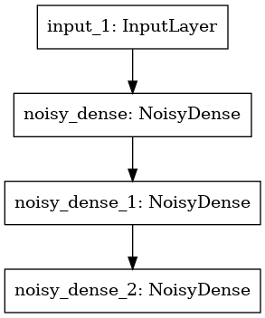

# DQN Maze

[](https://github.com/markub3327/DQN_MazeSolver/releases)


[](https://github.com/markub3327/DQN_MazeSolver/issues)


## The topology of the NoisyNet. 



In hidden layers is used **ReLU** activation function and linear activation function is used in the output layer.

## States

26 inputs = 2 position + 24 objects around agent

## Actions

* Up
* Down
* Left
* Right

**Run**
```
python3 main.py
```

## License

[](LICENSE)
